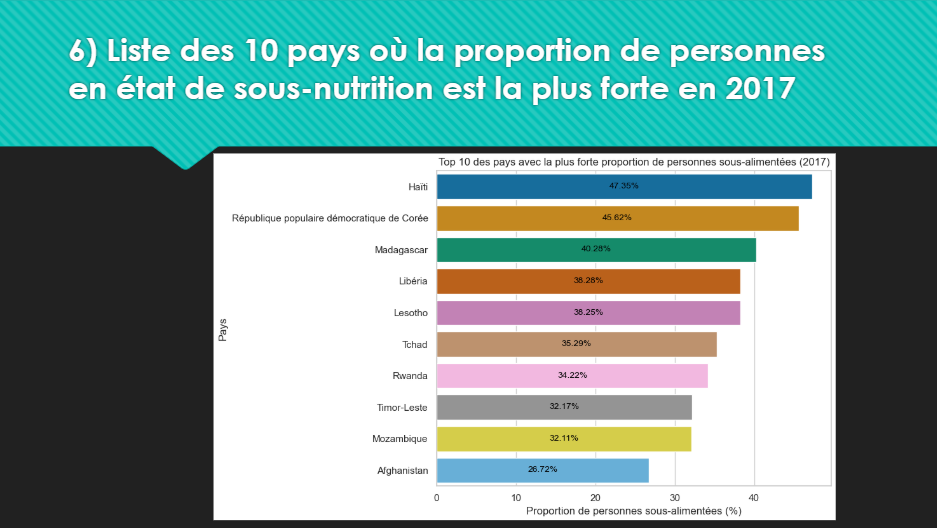
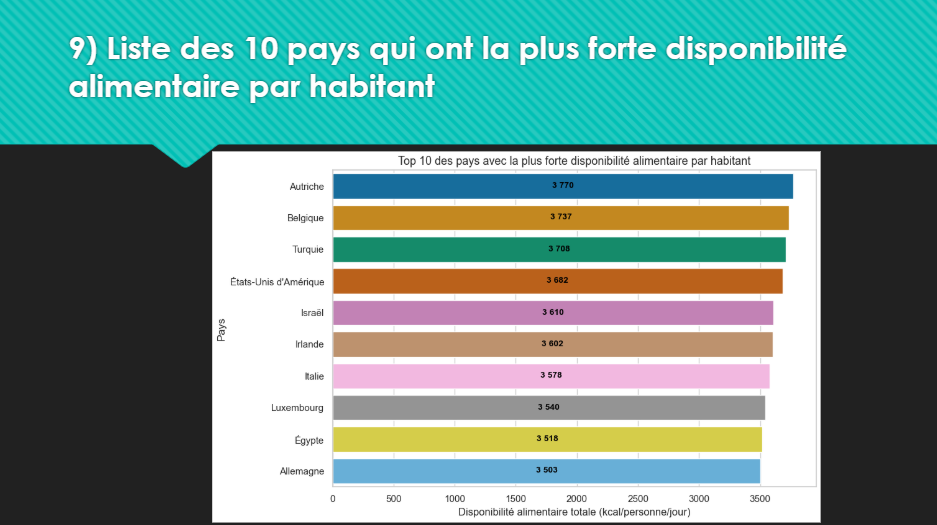
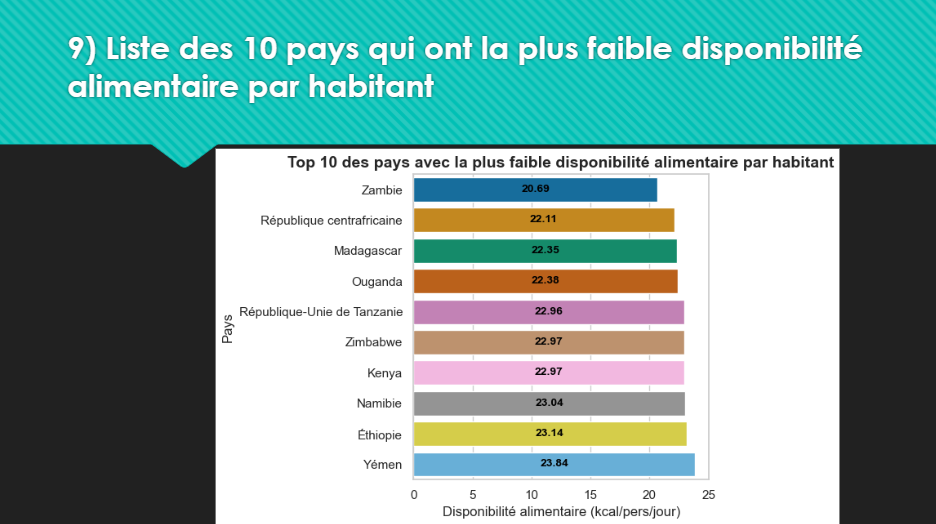

# 🌍 World Food Security Analysis

## 🎯 Project Objective:

This project aims to analyze global food security using FAO data in order to better understand inequalities in food availability and undernutrition situations around the world.

The study allows us to identify:
1. the most affected countries by undernutrition
2. food availability per capita
3. disparities between different regions of the world

---

## 📊 Data Used:
The data comes from the FAO (Food and Agriculture Organization of the United Nations) and includes:
1. global food aid
2. food availability
3. world population
4. undernutrition indicators

---

## 🧪 Methodology:
The analysis was carried out using Python.

---

## Libraries Used:
- Pandas
- Matplotlib
- Seaborn

---

## Steps Performed:
1. data cleaning and preparation
2. joins between multiple datasets (merge)
3. exploratory data analysis
4. statistical aggregations
5. data visualization

---

## 📈 Analyses Performed:
1. Countries most affected by undernutrition
Identification of the 10 most affected countries in 2017.

2. Food availability by country:
Comparison of food availability per capita.

3. Most vulnerable countries:
Analysis of countries with the lowest food availability.

---

## 📷 Visualizations:

The charts produced help illustrate the main analyses of the project.

---

## 📌 Key Results:

1. Strong inequality in the distribution of food resources
2. Some countries are highly affected by undernutrition
3. Food availability varies greatly between regions

---

## 🧰 Tools Used:
- Python
- Pandas
- Matplotlib
- Seaborn
- VS Code

---

## 📌 Conclusion:

This project highlights global inequalities in food security and helps better understand the challenges related to the distribution of food resources worldwide.

---

## 📷 Graph Overview

List of the 10 countries with the highest proportion of undernourished people in 2017 :

List of the 10 countries with the highest food availability per capita :

List of the 10 countries with the lowest food availability per capita :

---

# 🌍 World Food Security Analysis

## 🎯 Objectif du projet :

Ce projet a pour objectif d’analyser la sécurité alimentaire mondiale à partir de données issues de la FAO afin de mieux comprendre les inégalités de disponibilité alimentaire et les situations de sous-nutrition dans le monde.

L’étude permet d’identifier :
1. les pays les plus touchés par la sous-nutrition
2. la disponibilité alimentaire par habitant
3. les disparités entre les différentes régions du monde

---

## 📊 Données utilisées :
Les données proviennent de la FAO (Food and Agriculture Organization of the United Nations) et comprennent :
1. aide alimentaire mondiale
2. disponibilité alimentaire
3. population mondiale
4. indicateurs de sous-nutrition

---

## 🧪 Méthodologie :
L’analyse a été réalisée en Python.

---

## Librairies utilisées :
- Pandas
- Matplotlib
- Seaborn

---

## Étapes réalisées :
1. nettoyage et préparation des données
2. jointures entre plusieurs datasets (merge)
3. analyses exploratoires
4. agrégations statistiques
5. visualisation des résultats

---

## 📈 Analyses réalisées :
1. Pays les plus touchés par la sous-nutrition
Identification des 10 pays les plus concernés en 2017.

2. Disponibilité alimentaire par pays :
Comparaison de la disponibilité alimentaire par habitant.

3. Pays les plus vulnérables :
Analyse des pays ayant la plus faible disponibilité alimentaire.
---
## 📷 Visualisations :

Les graphiques réalisés permettent d’illustrer les analyses principales du projet.

---

## 📌 Résultats clés :

1. Forte inégalité de répartition des ressources alimentaires
2. Certains pays sont fortement touchés par la sous-nutrition
3. La disponibilité alimentaire varie fortement selon les régions
   
---

## 🧰 Outils utilisés :
- Python
- Pandas
- Matplotlib
- Seaborn
- VS Code
---
## 📌 Conclusion :

Ce projet met en évidence les inégalités mondiales en matière de sécurité alimentaire et permet de mieux comprendre les enjeux liés à la distribution des ressources alimentaires dans le monde.

---

## 📷 Aperçu des graphiques

